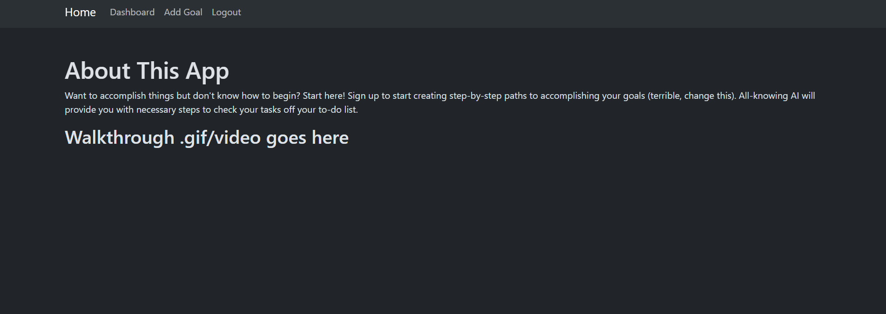

# Step-By-Step App
  
Github repo:

Heroku deployement:


## User Story

```
AS WEB developers working for a non-profit organization that helps people to acheive their goals
WE WANT to create a step-by-step webpage or app that will assist those people through react js and an all-knowing AI
SO THAT people can achieve their goals and have a meaningful/fulfilling life 
```

## Acceptance Criteria 

```
Given we have achieved the development of the step-by-step webpage through react js and an all-knowing AI
WHEN we run the command "npm run develop" through the root of the files
THEN the homepage will be uploaded through the web browser
WHEN presented with the homepage
THEN the homepage will give a brief description of the purposes of this webpage
WHEN the login option that is located in the header is clicked on 
THEN the users will be taken to the signup/login authentication page
WHEN the users signup or login 
THEN the users will be taken to the dashboard page that shows all the goals that are in progress and completed
WHEN the users click on the "Add Goal" option up in the header
THEN the users will be taken to the add goal page where the step-by-step process to acheive the goal will be generated


```

## Image 

Below: image of the step-by-step webpage that was created.


## Team Members

```
Kurt Wennsman
Leah Tillman
Peter Krause
Joey Thao
```