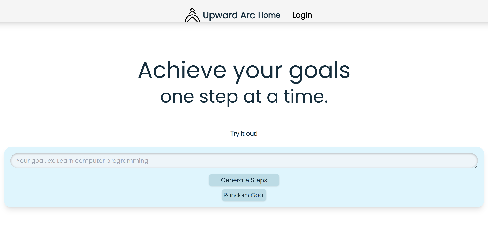
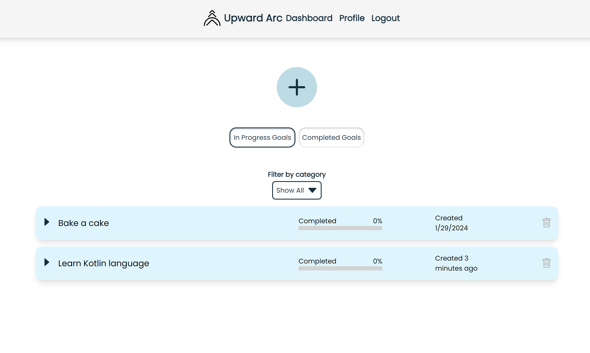
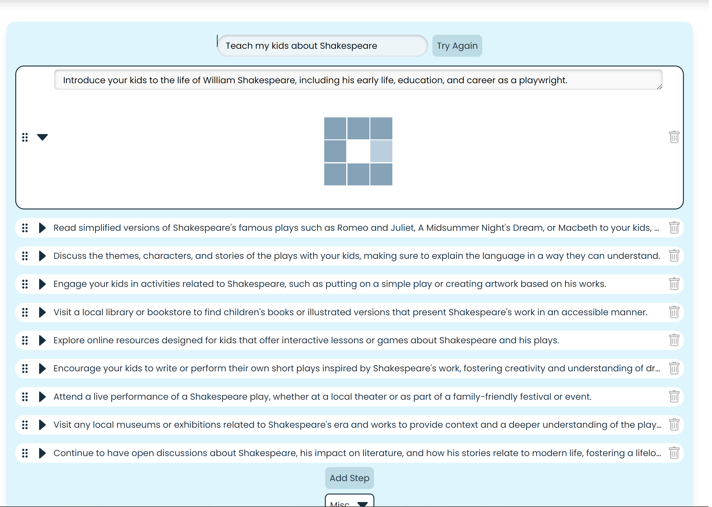
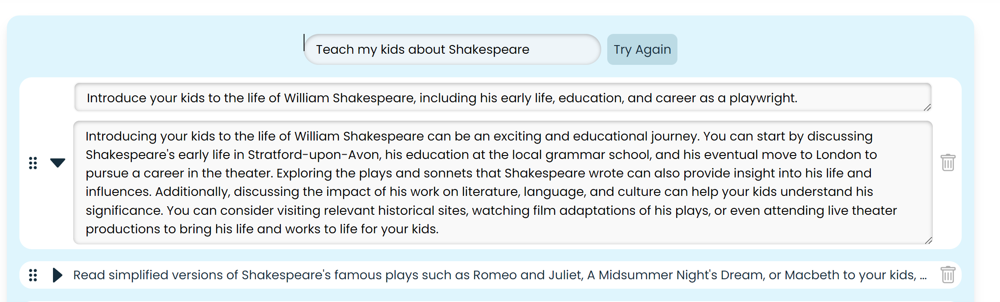
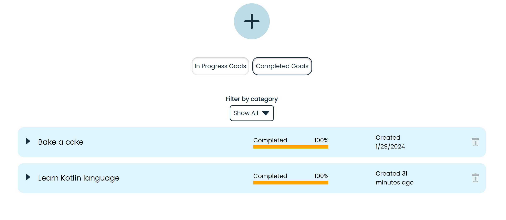

# Upward Arc

- ## [Check It Out Here](https://upwardarc.com/)

## Background Story

The intial idea was to help users come up with a series of steps to be able to accomplish any goal, a roadmap of sorts. Oftentimes, figuring out where to start can be a great impediment to successfully completing goals. Users can try it out on the homepage as the core functionality is accessible without log in, however to Save goals and track progress user will need an account. Once logged in, there is a user dashboard of all of the saved goals with the ability to update and track progress, including the ability to expound on a step with the ```More Info``` button. It features OpenAI API integration and is actually a natural extension of ChatGPT when it comes to executing a goal or task that is more complex because it breaks the goal into steps and keeps the relevant information together without losing your train of thought.

## Image 

Below: image of the homepage for step-by-step app that was created.



- Dashboard (only available to logged in)



- ```More Info``` Button




- ```Filter``` by In Progress or Completed



&copy; 2023-2024 SBS Development Group
