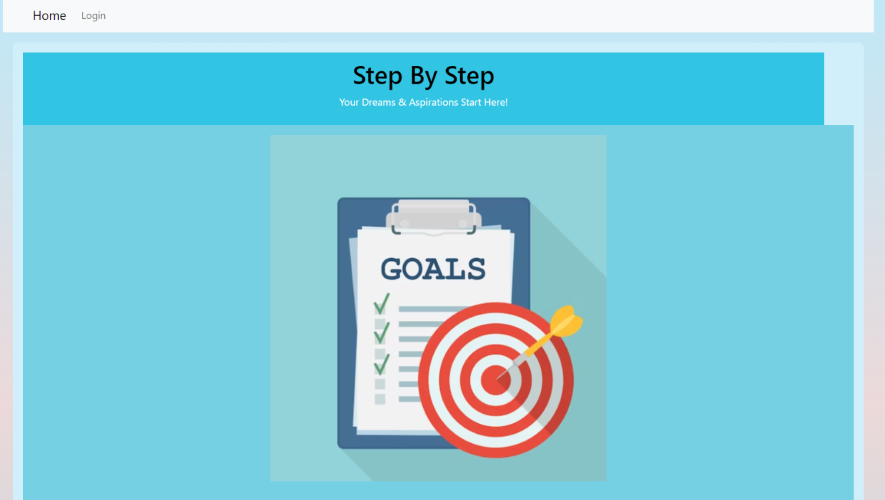

# Step-By-Step App
```
Github repo:
https://github.com/Osorkon21/step-by-step-app

Heroku deployement:
https://step-by-step-2d601ea78552.herokuapp.com/

```

## Background Story

```
As a non-profit organization we believed in assisting people to the best of our abilities therefore we 
have come up with an app that will assist others when it comes to achieving their goals. We know about
the struggles of achieving one's goal so we decided to use the most cutting-edge tech to assist others with
achieving their goals. The tech that we are using is an all-knowing AI that will generate the necessary steps
that need to be taken in order to achieve that specific goal. What is awesome about this app is that you don't
have to do any research on how to achieve your goal you simply just type in whatever that you are trying to achieve 
and the AI will generate those steps for you. Another awesome perk about this app is that it is completely free
so sign up now to become a member.
```

## Information About the App

```
The app we are developing is a step-by-step explanation of acheiving one's goals. We are using the assistance 
of an all-knowing AI to generate the step-by-step process that helps explain what needs to be done in order 
to achieve those goals. When the users enter the homepage of the app, they will be presented with the homepage 
that explains what is the purposes of this app and there also in the header where the users can navigate 
to the signup/login page. Once the users enter the signup/login page, they will have to signup/login with 
their email and password. After signing in or logging in, the users will be taken to the goal page where it will show
a list of their goals in progress and completed goals. If the users have not set up any goals or want to add new 
goals, the users can click the add-goal option in the header and it will take them to the add-goal page where
they can learn the step-by-step process of achieving that goal which is generated by the all-knowing AI. 
```

## Image 

```
Below: image of the homepage for step-by-step app that was created.
```


## Team Members

```
Kurt Wennsman - napoleondd86 (Github username)
Leah Tillman - lrltillman (Github username)
Peter Krause - Osorkon21 (Github username)
Joey Thao - Thaodev23 (Github username)
```

